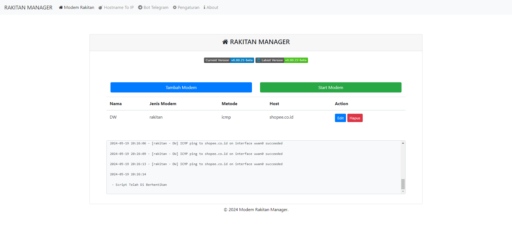
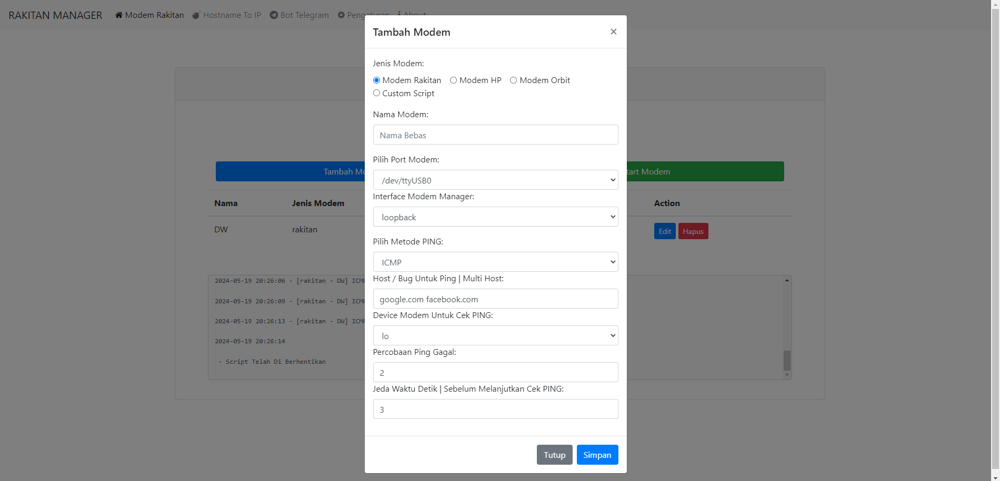
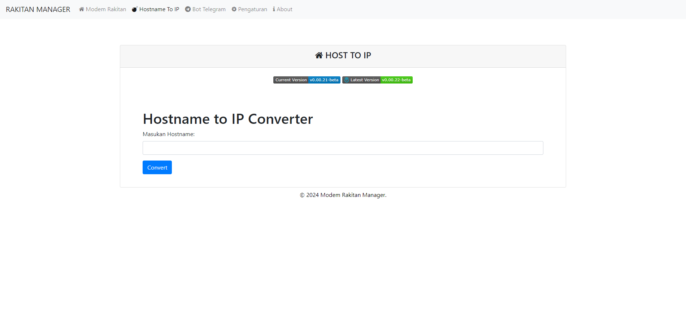
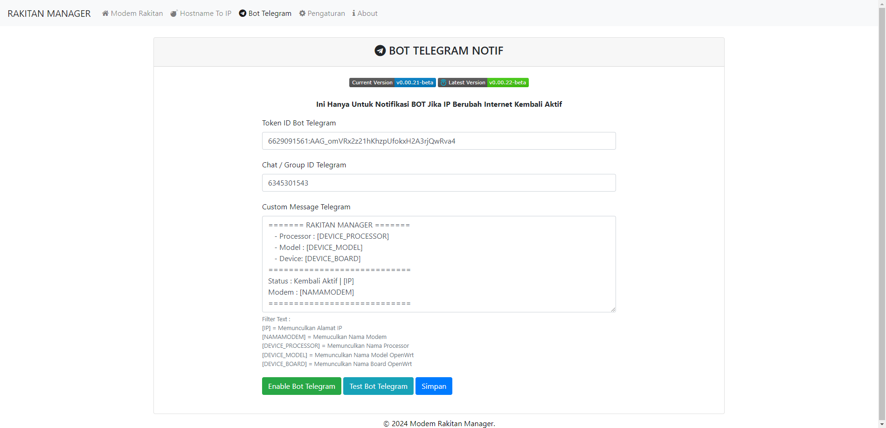
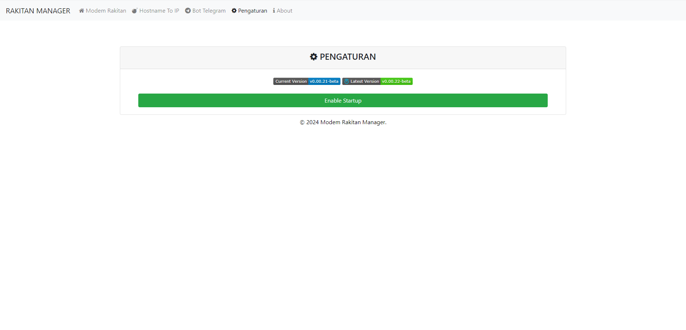

<h1 align="center">
  <br>RakitanManager<br>
  <p align="center">Advanced Modem Management System for OpenWrt</p>
</h1>

  <p align="center">
	<a target="_blank" href="https://github.com/rtaserver/RakitanManager/tree/package/main">
    
    </a>
    <a target="_blank" href="https://github.com/rtaserver/RakitanManager/blob/main/LICENSE">
    
    </a>
    <a target="_blank" href="https://github.com/rtaserver/RakitanManager/stargazers">
    
    </a>
  </p>

<p align="center">
<strong>Modem Rakitan • Modem HP • Modem Huawei / Orbit • MF90</strong>
</p>

## 📋 Table of Contents

- [About](#about)
- [Features](#features)
- [Requirements](#requirements)
- [Installation](#installation)
- [Usage](#usage)
- [Configuration](#configuration)
- [Supported Modems](#supported-modems)
- [Troubleshooting](#troubleshooting)
- [Contributing](#contributing)
- [License](#license)

## 📖 About

RakitanManager is a comprehensive modem management system designed for OpenWrt routers. It provides automated monitoring, reconnection, and IP renewal capabilities for various modem types, ensuring stable internet connectivity with minimal manual intervention.

## ✨ Features

### 🔄 Auto Management
- **Auto Reconnect** - Automatic modem reconnection on connection loss
- **IP Renewal** - Smart IP renewal for all supported modem types
- **Health Monitoring** - Continuous connection health checks
- **Failover Support** - Automatic switching between multiple modems

### 📡 Modem Support
- **Rakitan Modems** - Full automation for Rakitan-based modems
- **HP Modems** - Android-based modem management with ADB
- **Huawei/Orbit Modems** - LTE API integration for IP renewal
- **Hilink Modems** - Web interface automation
- **MF90 Modems** - Advanced ZTE MF90 management

### 🔔 Notifications
- **Telegram Bot** - Real-time notifications for connection events
- **Custom Messages** - Configurable notification templates
- **Status Updates** - Connection status monitoring

### 🌐 Network Tools
- **Host to IP Resolution** - Domain name resolution
- **Ping Testing** - Multiple ping methods (ICMP, HTTP, HTTPS, CURL)
- **Interface Monitoring** - Network interface status tracking

### 🛠️ Management
- **Web Interface** - User-friendly LuCI web interface
- **CLI Tools** - Command-line management options
- **Log Management** - Comprehensive logging with rotation
- **Configuration Backup** - Easy configuration management

## 📋 Requirements

### System Requirements
- **OpenWrt** (18.06 or later recommended)
- **50MB** free disk space
- **Internet connectivity** for installation

### Required Packages
- `modemmanager`
- `python3-pip`
- `jq`
- `adb`
- `php8`
- `uhttpd`
- `curl`
- `unzip`
- `luci-compat` (for LuCI >= 19.07)

### Python Dependencies
- `requests`
- `huawei-lte-api`

## 🚀 Installation

### Automated Installation (Recommended)

Using Terminal/SSH on your OpenWrt device:

```bash
# Run the automated installer
bash -c "$(wget -qO - 'https://raw.githubusercontent.com/rtaserver/RakitanManager/dev/install.sh')"
```

The installer will:
- ✅ Check system requirements
- ✅ Install all required packages
- ✅ Configure web server
- ✅ Download and install RakitanManager
- ✅ Set up proper permissions

### Manual Installation

1. **Download the IPK package:**
   - [Main Branch](https://github.com/rtaserver/RakitanManager/tree/package/main) (Stable)
   - [Dev Branch](https://github.com/rtaserver/RakitanManager/tree/package/dev) (Latest features)

2. **Install via opkg:**
   ```bash
   opkg install luci-app-rakitanmanager_*.ipk
   ```

3. **Access the web interface:**
   - Open your browser and navigate to: `http://192.168.1.1/rakitanmanager`
   - Or access through LuCI: System → RakitanManager

## 📖 Usage

### Web Interface
1. Navigate to the RakitanManager interface
2. Configure your modem settings
3. Set up Telegram notifications (optional)
4. Start monitoring your modems

### Command Line
```bash
# Start monitoring
/usr/share/rakitanmanager/core-manager.sh -s

# Stop monitoring
/usr/share/rakitanmanager/core-manager.sh -k

# Test bot notification
/usr/share/rakitanmanager/core-manager.sh bot_test
```

## ⚙️ Configuration

### Modem Configuration
Each modem requires specific configuration:

#### Rakitan Modem
```json
{
  "nama": "Modem1",
  "jenis": "rakitan",
  "devicemodem": "usb0",
  "portmodem": "5555",
  "interface": "wwan0"
}
```

#### HP Modem
```json
{
  "nama": "HP_Modem",
  "jenis": "hp",
  "androidid": "device_id",
  "modpes": "modpesv2"
}
```

#### Huawei/Orbit Modem
```json
{
  "nama": "Huawei_Modem",
  "jenis": "orbit",
  "iporbit": "192.168.8.1",
  "usernameorbit": "admin",
  "passwordorbit": "password"
}
```

### Telegram Configuration
Set up bot notifications in `/etc/config/rakitanmanager`:
```bash
uci set rakitanmanager.telegram.token='YOUR_BOT_TOKEN'
uci set rakitanmanager.telegram.chatid='YOUR_CHAT_ID'
uci set rakitanmanager.telegram.enabled='1'
uci commit rakitanmanager
```

## 📱 Supported Modems

| Modem Type | Status | Features |
|------------|--------|----------|
| Rakitan | ✅ Full Support | Auto reconnect, IP renewal |
| HP (Android) | ✅ Full Support | ADB integration, airplane mode |
| Huawei Orbit | ✅ Full Support | LTE API, web interface |
| Huawei Hilink | ✅ Full Support | Web automation, IP renewal |
| ZTE MF90 | ✅ Full Support | Advanced management, WiFi control |
| Custom Script | ✅ Full Support | User-defined automation |

## 🔧 Troubleshooting

### Common Issues

**Installation Fails:**
- Check internet connectivity
- Ensure sufficient disk space (50MB minimum)
- Verify OpenWrt version compatibility

**Modem Not Connecting:**
- Check modem configuration in `data-modem.json`
- Verify modem is properly detected (`lsusb`, `ls /dev/ttyUSB*`)
- Check modem logs: `logread | grep rakitanmanager`

**Telegram Notifications Not Working:**
- Verify bot token and chat ID
- Check network connectivity to Telegram API
- Review bot permissions

**Web Interface Not Accessible:**
- Restart uhttpd: `/etc/init.d/uhttpd restart`
- Clear browser cache
- Check firewall settings

### Log Files
- Main log: `/var/log/rakitanmanager.log`
- Installation log: `/tmp/rakitanmanager_install.log`
- System logs: `logread | grep rakitan`

### Getting Help
- Check [Issues](https://github.com/rtaserver/RakitanManager/issues) for known problems
- Review [CHANGELOG.md](CHANGELOG.md) for recent updates
- Join our [Telegram Group](https://t.me/rtaserver) for community support

## 🤝 Contributing

We welcome contributions! Please see our [Contributing Guidelines](CONTRIBUTING.md) for details.

### Development Setup
```bash
# Clone the repository
git clone https://github.com/rtaserver/RakitanManager.git
cd RakitanManager

# Make your changes
# Test thoroughly

# Submit a pull request
```

## 📸 Screenshots

<p align="center">
  
  
</p>

<p align="center">
  
  
</p>

<p align="center">
  
</p>

## 📄 License

This project is licensed under the Apache License 2.0 - see the [LICENSE](LICENSE) file for details.

### Third-party Licenses
- [huawei-lte-api](https://github.com/Salamek/huawei-lte-api) by [Salamek](https://github.com/Salamek) - MIT License

## 🙏 Acknowledgments

- Thanks to the OpenWrt community for the amazing platform
- Special thanks to all contributors and testers
- Inspired by various modem management projects in the OpenWrt ecosystem

---

<p align="center">
  <strong>RakitanManager</strong> - Keep your connections stable and automated! 🚀
</p>

<p align="center">
  Made with ❤️ for the OpenWrt community
</p>

